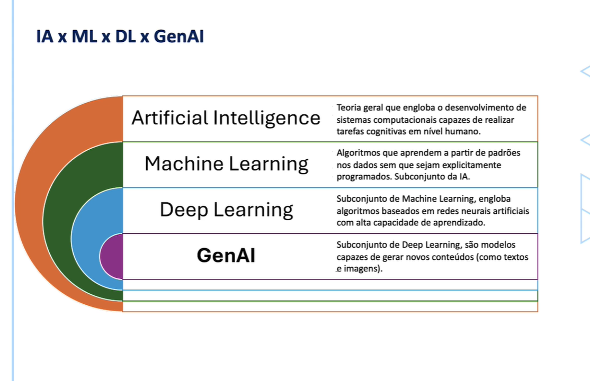

# Intel-ige-cia-Art-ficial

####      FUNDAMENTOS DA INTELIGÊNCIA ARTIFICIAL 

> → Definir o que é IA, quais sua principais técnicas e ferramentas 

#       O QUE REALMENTE É INTELIGÊNCIA ARTIFICIAL

>→ IA refere-se ao campo da ciência da computação que se concentra na criação de sistemas capazes de realizar tarefas que normalmente exigiria inteligência humana

>→ Estas tarefas incluem aprendizado, raciocínio, resolução de problemas, percepção, reconhecimento de padrões, compreensão de linguagem natural e interação com o ambiente.

>→ Ou seja, tentamos reproduzir nas máquinas a inteligência de um humano

        O segredo por trás da IA 

>→ IA é um conjunto de técnicas para construção de sistemas a fim de reproduzir nas máquinas a capacidade cognitiva dos seres humanos!!!

>→ Usamos matemática através de algoritmos que são treinados a partir de dados.

        Esses algoritmos são executados no computador através de linguagens de programação.
	
>→ Se existir um padrão nos dados, um algoritmo será capaz de aprender este padrão gerando assim um modelo. Esse modelo pode ser usado com novos dados para resolver o problema para o qual ele foi criado.

      → O ALGORITMO NÃO CRIA PADRÃO ELE DETECTA OS PADRÕES 

>→ Usamos matemática para tentar reproduzir inteligência humana nas máquinas

>Outros termos - Inteligência Artificial - Machine Learning - Deep Learning GenAI

1.  IA- Teoria geral que engloba o desenvolvimento de sistemas computacionais capazes de realizar tarefas cognitivas em nível humano 

2. Machine Learning - Algoritmos que aprendem a partir de padrões nos dados sem que sejam explicitamente programados. Subconjunto da IA.

3. Deep Learning - Subconjunto de Machine Learning, engloba algoritmos baseados em redes neurais artificiais com alta capacidade de aprendizado 

4. GenIA - Subconjunto de Deep Learning, são modelos capazes de gerar novos conteúdos (como textos e imagens.)

    

 

#      PRINCIPAIS CATEGORIAS DA IA

>IA Estreita - IA FRACA - Projetada para executar uma tarefa específica, como assistentes virtuais, reconhecimento fácil, sistemas de recomendações, etc. Não possui consciência ou entendimento além de suas funções programadas. É o que existe hoje em termos de IA.

>IA Geral - IA FORTE AGI - Uma IA teórica que teria capacidade de entender, aprender e aplicar conhecimento de maneira geral, semelhante à inteligência humana. Ainda não foi desenvolvida e é um tópico de pesquisa e debate - Não existe!! Ainda

     ~~  ~~ NOTA: Modelos Generativos Multimodais (que geram texto e imagem, por exemplo) Não são IA Geral, mas sim a junção de vários modelos de IA Estreita em uma única solução

# TÉCNICAS COMUM EM IA 

1. Machine Learning - APRENDIZADO DE MÁQUINA: Subcampo da IA que utiliza algoritmos para aprender padrões a partir de dados e fazer previsões ou decisões sem ser explicitamente programado para cada tarefa.

2. Deep Learning APRENDIZADO PROFUNDO: Um tipo de Machine Learning que utiliza redes neuras artificiais com muitas camadas (redes neurais profundas) para modelar padrões complexos em grandes quantidades de dados.

3. Aprendizado por Reforço: Subcampo da IA onde um agente aprende a tomar decisões sequenciais interagindo com um ambiente. O agente recebe recompensas ou punição com base nas ações que executa e seu objetivo é maximizar a recompensa total ao longo do tempo. Amplamente aplicado em áreas como robótica, jogos, controle de sistemas e robôs de investimentos.

# HISTÓRIA E EVOLUÇÃO DA IA

>Aqui está uma linha do tempo destacando os principais eventos na história e evolução da Inteligência Artificial:

	     → Anos 1940-1950: Primeiro Modelo Matemático 

1. 1943: Warren McCulloch e Walter Pitts propõem o primeiro modelo matemático de uma rede neural.

2. 1950: Alan Turing publica “Computing Machinery and Intelligence” e propõe o Teste de Turing para determinar se uma máquina pode exibir comportamento inteligente equivalente ao humano.

        → Anos 1950 e 1960: Primeiros Passos e Surgimento do   Termo “Inteligência Artificial)

1. 1956: Conferência de Dartmouth, onde o termo “Inteligência Artificial” surgiu pela primeira vez. Esta conferência é considerada o ponto de partida oficial do campo da IA.

2. 1957: Frank Rosenblatt desenvolve o Perceptron, um algoritmo de aprendizado supervisionado para redes neurais.

3. 1958: John McCarthy desenvolve a linguagem de programação LISP, que se torna fundamental para a pesquisa em IA.

	     → Anos 1960-1970: Otimismo e Primeiro Sistemas

1. 1965: Joseph Weizenbaum cria o ELIZA, um dos primeiros programas de processamento de linguagem natural.

2. 1969: Marvin Minsky e Seymour Papert Publicam “Perceptrons”, mostrando limitações das redes neurais da época, o que leva a um declínio no interesse por essa abordagem. 
	
		→ Anos 1970-1980 “Inverno da IA” e Desenvolvimento de Sistemas Especialistas 

1. 1970: Primeira crise de financiamento para IA, conhecida como o “Inverno da IA”, devido a promessas não cumpridas e limitações tecnológicas. 

2. 1972: Prolog, uma linguagem de programação lógica, é desenvolvida por Alain Colmeraur. 

3. 1980: Evolução dos primeiros “sistemas especialistas” como DENDRAL, para análise química, e MYCIN, para diagnóstico médico.

		→ Anos 1980- 1990 Revitalização da IA

1. 1986: Desenvolvimento do algoritmo de retropropagação (backpropagation) para treinamento de redes neurais, levando a um renascimento no interesse pelo aprendizado de máquina. O backpropagation é a técnica usada até hoje no treinamento de modelos de Deep Learning, principal estratégia de IA da atualidade.

2. 1987: Segunda crise de financiamento, o “Segundo Inverno da IA”, devido ao fracasso dos sistemas especialistas em cumprir expectativas comerciais. 

	     	→ Anos 1990-200 IA do Cotidiano

1. 1997: O computador Deep Blue da IBM derrota o campeão mundial de xadrez Garry Kasparov, um marco significativo da IA. 

2. 1999: Começam a surgir as poderosas GPUs (Unidades de Processamento Gráfico)
da Nvidia, inicialmente criadas para renderizar jogos de computador, mas que se tornaram o principal motor de evolução da IA devido à capacidade de paralelizar as operações com matrizes, operações matemáticas por trás dos algoritmos de redes neurais artificiais. A Nvidia é hoje a principal fabricante de GPUs do mundo e uma das empresas mais valiosas do planeta!

	    	→ Anos 2000-2010 IA na Internet , Big Data e GPU

1. 2005: O termo Big Data foi definido pela primeira vez representando grandes volumes de dados, gerados em  alta velocidade e alta variedade. O combustível que a IA precisava. 

2. 2006: Geoffrey Hinton e seus colegas popularizam o termo “aprendizado profundo” e demonstram seu potencial em reconhecimento de padrões.

3. 2009: O uso de GPU (Unidade de Processamento Gráfico) começa a ganhar destaque, acelerando de forma considerável o treinamento e uso dos modelos de IA. Se Big Data foi o combustível a GPU foi a ignição 

	    	→ Anos 2010-2020: IA Avançada e Aplicações Práticas

1. 2012: A arquitetura de aprendizado profundo AlexNet (Rede Neural Convolucional - CNN)
vence a competição de reconhecimento de imagens ImageNet, demonstrando o poder das redes neurais profundas.

2. 2016: AlphaGo, da DeepMind, derrota o campeão mundial de Go, um jogo conhecido por sua complexidade estratégica

3. 2017: O paper de pesquisa “Attention is All You Need” lança uma nova maneira de aprender sequências com base em contexto, através da arquitetura de Transformadores e Módulo de Atenção 

		→ Anos: 2020-2025: IA Avançada e Aplicações Práticas

1. 2020: Vários modelos baseados na arquitetura de Transformadores são propostos criando uma nova geração de sistemas de IA, incluindo os modelos GPT.

2. 2021: IA é amplamente utilizada em diversas áreas, incluindo saúde, finanças, transporte e entretenimento. Aumentam as preocupações éticas sobre privacidade, viés e impacto no emprego.

3. 2022: A OpenAI lança o Chat GPT e revela ao mundo a capacidade da IA Generativa - que já existia antes do Chat GPT

4. 2023: Começa a corrida para construir LLMs (Large Language Models)  cada vez mais poderosos. Desenvolvimento contínuo de IA em áreas como condução autônoma, diagnóstico médico e assistentes pessoais inteligentes. 

5.2024: A Meta AI lança o mais poderoso LLM open-source com 405 bilhões de parâmetros.

# IA E CIÊNCIA DE DADOS

===== COLOCAR IMAGEM ==========

> Deep Learning, Dados e GPU = A Tempestade Perfeita

======= COLOCAR IMAGEM =========

>Deep Learning, Dados e GPU formam a tempestade perfeita na era da IA

>Deep Learning, com suas redes neurais complexas, demanda vastas quantidades de dados para treinamento eficaz, enquanto as GPUs fornecem o poder computacional necessário para processar esses dados de maneira rápida e eficiente. 

>A sinergia entre esses elementos permite avanços rápidos em áreas como reconhecimento de imagem, processamento de linguagem natural e modelagem preditiva, transformando o mercado de trabalho e abrindo novas fronteiras tecnológicas. 

# PROGRAMAÇÃO DE COMPUTADORES NA ERA DA IA 

>Programar em IA vai além de usar uma linguagem de script. Envolve a criação de sistemas que podem aprender e tomar decisões de maneira autônoma. Isso incluiu o desenvolvimento de algoritmos de aprendizado de máquina, redes neurais, processamento de linguagem natural e outras técnicas avançadas. 

>A programação de IA utiliza linguagens como Python, R, Rust, C++, Scala ou Java, e frameworks como TensorFlow, PyTorch, e Scikit-Learn, mas também requer um entendimento profundo de matemática, estatística e lógica.

>Além disso, implica em lidar com grandes volumes de dados, pré-processamento, treinamento de modelos, avaliações e otimização contínua para melhorar a precisão e a eficiência dos sistemas de IA.
